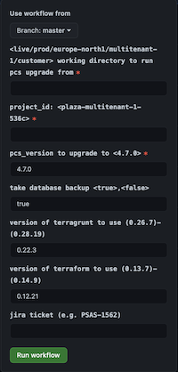

# Trigger github workflow API

## Why

In github you can trigger a workflow run via the Web UI:

The problem is that these values are free text fields. This can ofc have great negative impact if someone enters wrong values.

## The plan

The high level view:
1. Create an API that basically just triggers the workflow via Github's API
2. Create an web frontend that uses this API and provides a convenient user experience for triggering 
